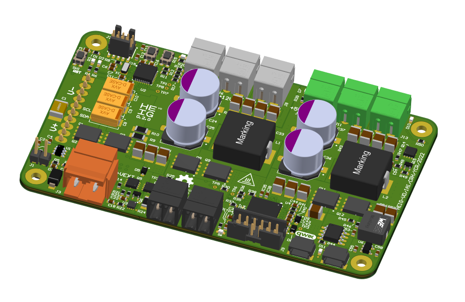

# Power Supply for DJI Mavic Battery

Main Power Supply for the CRH Eurobot contest. This power supply allow full control over the 
different power supplies generated from a DJI Mavic2 battery (15.5V):

- 5 V @ 10 A
- 10..12 V @ 10 A
- 3.3 V @ 4 A

I2C Qwiic connectors can control the output voltages and monitor the flowing current. An emergency 
switch connector will shut down all power voltages. 

  
## Mise en service prototype

1. Supprimer R22 car le INA381 pose problème et on retrouve 4V sur pin 7
2. Éviter la série E96, R45 = 24k et R46 = 75k -> (75/24 + 1) * 0.8 = 3.3000000000000003
3. R51 à 8k2, ca devrait le faire
4. Q4 n'est pas nécessaire il empeche d'avoir de la tension sur SENSE, on peut le supprimer et mettre une zéro ohm entre S et D
5. Mettre leds vertes partout sauf sur D2 en rouge
6. Bug sur I2C, inversion SDA/SCL 

Vérifier C57 ou C58 ? Hein ? 

### Première mise sous tension

0. Contôle visuel sous loupe
1. Alimenter J3, limité en courant à 10mA, monter jusqu'à 15V. Vérifier la présence du 3.3V sur C58
2. Se connecter sur J9 avec le DC1613 et LTPowerPlay
3. Configurer le LTC3886
4. Se connecter sur le MCU
5. Charger un programme de base (celui qui active le 5V et le 12V)
6. Vérifier les tensions de sorties 5V et 12V
7. CC SB1 pour sauvegarder la config
