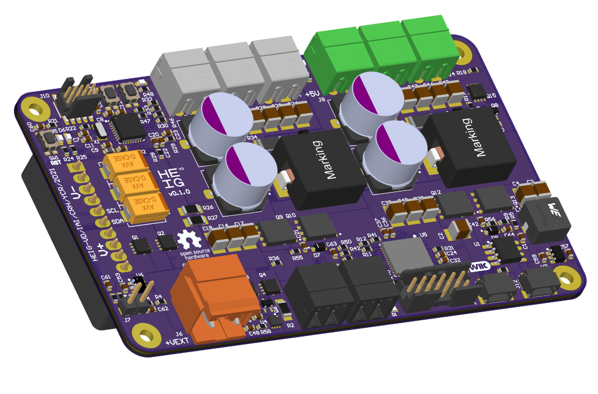

# Power Supply for DJI Mavic Battery

Main Power Supply for the CRH Eurobot contest. This power supply allow full control over the 
different power supplies generated from a DJI Mavic2 battery (15.5V):

- 5 V @ 10 A
- 10..12 V @ 10 A
- 3.3 V @ 4 A

I2C Qwiic connectors can control the output voltages and monitor the flowing current. An emergency 
switch connector will shut down all power voltages. 

  
