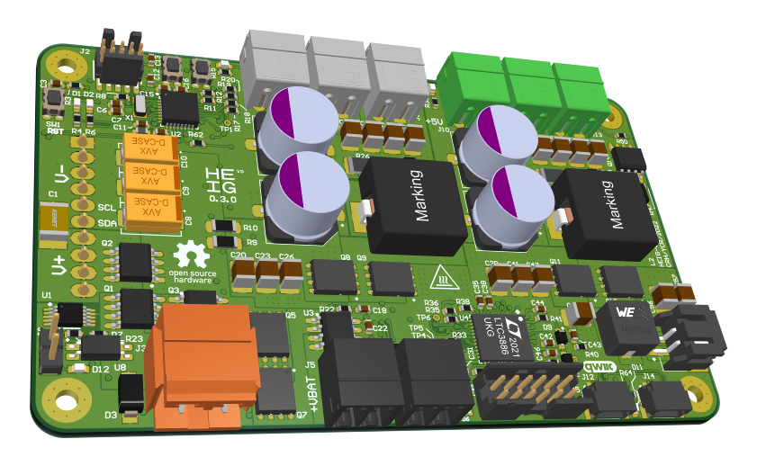

# CRH Power Supply Board

The Main Power Supply Board is a highly compact electronic board made to power up an embedded robot from a DJI Mavic 2 Battery (4-cell Li-Po) or an external power supply.

**The schematics** is available [here](Assets/schemtatics.pdf).

The board provides:

- 5 V @ 10 A Output
- 10..12 V @ 10 A Configurable Output
- 3.3 V @ 4 A Output (that may power the Qwiic System)

I2C Qwiic connectors can control the output voltages and monitor the flowing current in all outputs. An emergency switch connector will shut down all power voltages.

## Detailed specifications

- Mechanical
  - 95x58 mm
  - 4x M2.5 fixation holes
- Connectors
  - 1x 2-pin 7.62 mm External Power
  - 2x 2-pin 3.5 mm Black Battery output (on/off)
  - 2x 2-pin 3.5 mm Green 5V Output (on/off)
  - 1x 2-pin 3.5 mm Green 5V Output (on/off)
  - 3x 2-pin 3.5 mm Gray 10..12V Output (on/off)
  - 1x 12-pin LTPower debug port (For DC1613 debug probe)
  - 1x 10-pin SWD debug port for the MCU (ATSAMD20E)
  - 1x 10-pin DJI Mavic Zoom battery port
  - 1x 2-pin Emergency stop
- Pushbuttons
  - 1x Reset
  - 1x Manual Enable/disable 10..12V
  - 1x Manual Enable/disable 5V
- Monitoring
  - 5V Voltage
  - 10..12V Voltage
  - Battery voltage
  - 3.3V Voltage
  - 5V Current
  - 10..12V Current
  - Total Current consumption
  - Efficiency monitoring
  - Total Power consumption
  - I2C DJI Mavic BMS
    - Cell voltage
    - Battery cycles
    - Charge state
    - Battery life status
    - ...
- Control
  - LTC3886-1
  - ATSAMD20E
- PCB
  - 4L 6C 1.55 mm

## Revisions

### 0.1.0 Alpha (2021-10-10)

Errata:

- LTC3886 I2C address not configured (set to 0x00)
- INA381 current monitoring not working
- SCL/SDA inverted on Qwiic connectors
- Q6, Q15 should be P-MOS not N-MOS
- Missing thermal relief on most pads
- Some vias are not tamped
- Missing testpoints
- Oshpark purple PCB soldermask not good

### 0.2.0 Alpha

- Switch Frequency and phase EEPROM configured
- I2C configured by resistor
- Add testpoints
- Changed PCB color to green
- 3.3V divisor configured by E12 series instead of E96
- Add RC filter on INA381

### 0.3.0 Alpha (2022-04-23)

- Fix components absolute maximum voltage from 20ish to 40V.
- Add a I2C power monitoring and switch
- Add a 3.3V connector
- Add Hardware ESTOP (Emergency Stop) through an optocoupler
- Add ESTOP LED
- Change P-MOS switch for VBAT outputs for N-MOS
- Change the VBAT current monitoring IC for a Hall effect sensor
- Change number of layers from 4 to 6
- Fix via in pad issues with filled via (Eurocircuits option)
- Add vias in fixation holes
- Change the VEXT/VBAT switch IC for a more specialized one
- Fix LTC3886 resistors and I2C address

## Setup instructions

### Mise en service prototype

1. Supprimer R22 car le INA381 pose problème et on retrouve 4V sur pin 7
2. Éviter la série E96, R45 = 24k et R46 = 75k -> (75/24 + 1) * 0.8 = 3.3000000000000003
3. R51 à 8k2, ca devrait le faire
4. Q4 n'est pas nécessaire il empeche d'avoir de la tension sur SENSE, on peut le supprimer et mettre une zéro ohm entre S et D
5. Mettre leds vertes partout sauf sur D2 en rouge
6. Bug sur I2C, inversion SDA/SCL

Vérifier C57 ou C58 ? Hein ?

### Première mise sous tension

0. Contôle visuel sous loupe
1. Alimenter J3, limité en courant à 10mA, monter jusqu'à 15V. Vérifier la présence du 3.3V sur C58
2. Se connecter sur J9 avec le DC1613 et LTPowerPlay
3. Configurer le LTC3886
4. Se connecter sur le MCU
5. Charger un programme de base (celui qui active le 5V et le 12V)
6. Vérifier les tensions de sorties 5V et 12V
7. CC SB1 pour sauvegarder la config

## License Information

This product is **open-source**